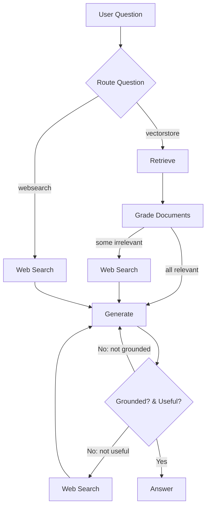

<div align="center">

# Agentic RAG (Retrieval Augmented Generation with Adaptive Grading & Routing)

An end-to-end, agentic Retrieval-Augmented Generation system built with **LangGraph** + **LangChain** that:

</div>

- Intelligently routes user questions to either a local vectorstore or live web search
- Grades retrieved documents for relevance before using them
- Generates an answer grounded in the retained context
- Detects hallucinations and retries if the answer is not supported
- Verifies whether the final answer actually addresses the user question

---

## 🔍 Why this project?

Traditional RAG pipelines blindly retrieve k documents and feed them to an LLM. This project adds **agentic control loops** and **structured evaluators** so the system can _adapt_:

1. Route query → vectorstore vs web search (domain vs open world)
2. Filter out irrelevant retrieved chunks (document relevance grader)
3. Decide whether missing context warrants a web search
4. Generate an answer from curated context
5. Grade the answer for grounding (hallucination check)
6. Grade the answer for usefulness (does it answer the question?)
7. Retry / augment context / terminate accordingly

The result: higher factual precision and reduced hallucinations with transparent decision points.

---

## 🧠 Architecture Overview

Core runtime is a **LangGraph StateGraph**. Nodes mutate a shared `GraphState`:

| Node              | Purpose                                                      |
| ----------------- | ------------------------------------------------------------ |
| `retrieve`        | Query Chroma vectorstore to get semantically relevant chunks |
| `grade_documents` | Binary relevance grading per chunk (LLM-structured output)   |
| `web_search`      | Fetch fresh snippets via Tavily when needed                  |
| `generate`        | Produce an answer from curated context                       |

Decision functions orchestrate transitions:

- `route_question` → (vectorstore | websearch) initial branch
- `decide_to_generate` → add web search before generation if any doc was irrelevant
- `grade_generation_grounded_in_documents_and_question` → (retry | success | augment)

Generated graph image: `graph.png` (auto-created by `graph/graph.py`).

Mermaid (conceptual):



---

## 🧩 State Object

`GraphState` (see `graph/state.py`):

```python
{
	"question": str,
	"documents": list[str | Document],
	"web_search": bool,
	"generation": str
}
```

---

## ⚙️ Components

| Category           | File                                | Notes                                                            |
| ------------------ | ----------------------------------- | ---------------------------------------------------------------- |
| Graph assembly     | `graph/graph.py`                    | Defines nodes, edges, conditional transitions, emits `graph.png` |
| Retrieval          | `ingestion.py`                      | Loads domain articles, splits, builds / loads Chroma vectorstore |
| Nodes              | `graph/nodes/*.py`                  | Retrieval, grading, generation, web search mutators              |
| Chains (LLM tools) | `graph/chains/*.py`                 | Reusable structured-output evaluators + generation prompt        |
| Constants          | `graph/consts.py`                   | Node name literals                                               |
| Entry point        | `main.py`                           | Simple demo invocation                                           |
| Tests              | `graph/chains/tests/test_chains.py` | Unit-like tests for graders, routing, generation                 |

---

## 📦 Tech Stack

- Python 3.12+
- LangChain / LangGraph
- Chroma DB (persistent local vectorstore `./.chroma`)
- HuggingFace sentence transformer embeddings (`all-MiniLM-L6-v2`)
- Groq LLM (`meta-llama/llama-4-scout-17b-16e-instruct`)
- Tavily web search API
- Pydantic structured output schemas for all graders / router

---

## 🔑 Environment Variables

Create a `.env` file (or export in shell):

```
GROQ_API_KEY=your_groq_key_here
TAVILY_API_KEY=your_tavily_key_here
```

Optional (if using proxies / HF tokens) add: `HUGGINGFACEHUB_API_TOKEN=...`

All modules call `load_dotenv()` early, so running from repo root with `.env` present is sufficient.

---

## 🚀 Quickstart

### 1. Clone & Enter

```bash
git clone <this-repo-url>
cd agentic-rag
```

### 2. Install Dependencies (uv recommended)

```bash
curl -LsSf https://astral.sh/uv/install.sh | sh   # if uv not installed
uv sync
```

Or with pip:

```bash
python -m venv .venv && source .venv/bin/activate
pip install -e .
```

### 3. Build / Ensure Vectorstore

On first run you must materialize the Chroma collection. In `ingestion.py` the creation block is commented out for speed. Uncomment the `Chroma.from_documents(...)` block temporarily and run:

```bash
python ingestion.py
```

This will persist embeddings to `./.chroma`. Then you can re-comment that block if desired (subsequent runs only need the retriever). Alternatively, replace that section with an explicit one-time script.

### 4. Run Demo

```bash
python main.py
```

Example output (truncated):

```
Hello Advanced RAG
---ROUTE QUESTION---
---ROUTE QUESTION TO RAG---
---RETRIEVE---
---CHECK DOCUMENT RELEVANCE TO QUESTION---
... -> final grounded answer dict
```

### 5. Run Tests

```bash
uv run pytest -q
# or
pytest -q
```

---

## 🧪 Evaluation Chains

Each grader is a small, strongly-typed chain:

| Chain                  | Schema                              | Purpose                           |
| ---------------------- | ----------------------------------- | --------------------------------- |
| `retrieval_grader`     | `GradeDocuments(binary_score)`      | Keep only relevant chunks         |
| `hallucination_grader` | `GradeHallucinations(binary_score)` | Ensure answer is grounded         |
| `answer_grader`        | `GradeAnswer(binary_score)`         | Ensure answer addresses question  |
| `question_router`      | `RouteQuery(datasource)`            | Route to vectorstore or websearch |

All leverage Groq LLM structured output for deterministic JSON parsing.

---

## 🔄 Control Logic Highlights

1. Initial route decides if domain-specific vectorstore suffices.
2. If any retrieved doc is irrelevant → opportunistically include web search before generating.
3. Generation is retried if hallucination grader returns "no" (not grounded).
4. If grounded but not useful → augment with web search and regenerate.
5. Terminal condition only when both grounded & useful.

---

## 🛠 Extending

| Goal                    | How                                                                               |
| ----------------------- | --------------------------------------------------------------------------------- |
| Add new datasource      | Create node + constant + conditional edge insertion in `graph/graph.py`           |
| Add citation extraction | Post-process `generation` with regex / LLM chain and attach to state              |
| Replace embeddings      | Swap `HuggingFaceEmbeddings` in `ingestion.py`                                    |
| Add caching             | Wrap retriever / graders with LangChain `RunnableWithFallback` or in-memory cache |
| Track metrics           | Instrument nodes (timings, token counts) and log to CSV / telemetry backend       |

---

## 🧯 Troubleshooting

| Symptom                           | Cause                      | Fix                                                      |
| --------------------------------- | -------------------------- | -------------------------------------------------------- |
| Empty retrieval results           | Vectorstore not built      | Run `python ingestion.py` after uncommenting build block |
| KeyError: GROQ_API_KEY            | Missing .env               | Add key & restart shell                                  |
| Slow first run                    | Embedding model download   | Allow initial HF model caching                           |
| Repeated hallucination retries    | Domain corpus lacks answer | Force web search route or add data                       |
| Unicode / SSL errors on ingestion | macOS cert issues          | `Install Certificates.command` (macOS Python)            |

---

## ♻️ Design Tradeoffs

- Uses LLM graders (higher cost) instead of heuristic similarity thresholds for transparency & adaptability.
- Simple rule-based transitions—could be replaced by bandit / reinforcement tuning.
- No persistent conversation memory yet; easily added as another state field and node.

---

## 🔮 Future Ideas

- Source attribution & inline citations
- Confidence scoring (aggregate grader signals)
- Multi-query expansion before retrieval
- Structured answer formats (JSON tool outputs)
- Semantic cache for common questions
- Async parallel retrieval + web search

---

## 📁 Project Layout

```
graph/              # LangGraph assembly + state + nodes + chains
ingestion.py        # Corpus loading + splitting + vectorstore (retriever)
main.py             # Demo runner
graph.png           # Auto-generated visual of compiled graph
pyproject.toml      # Dependencies / metadata
```

---

## ✅ Minimal Example (Inline)

```python
from graph.graph import app
result = app.invoke({"question": "what is agent memory?"})
print(result["generation"])  # grounded answer
```

---

## 🙌 Acknowledgements

- LangChain & LangGraph teams
- Groq for fast structured LLM responses
- Tavily for focused web search
- Source articles by Lilian Weng (agents, prompt engineering, adversarial attacks)

---

## 🗣 Contributing

Issues & PRs welcome. Suggested: add tests for any new node or chain (see existing test patterns in `graph/chains/tests/test_chains.py`).

---

Happy building. Strengthen retrieval, then let agents reason. 🔁
